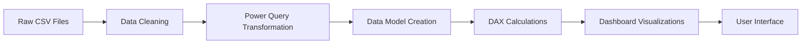

## 🚚📊 Supply Chain Analytics Dashboard

A dynamic Power BI dashboard designed to transform raw supply chain data into actionable insights. This tool enables real-time performance monitoring and data-driven decision-making for logistics optimization and business growth.

### 🎯 Project Overview

This project provides a comprehensive analysis of supply chain operations across multiple regions, focusing on delivery performance, customer behavior, and profitability. The dashboard is built in Microsoft Power BI, serving as a centralized hub for KPI monitoring and operational optimization.

**Key Features:**

* **Real-Time KPI Tracking**: Stay updated with automated alerts.
* **Interactive Visualizations**: Drill down into detailed insights.
* **Geographic Analysis**: Assess regional performance globally.
* **Customer Insights**: Segment behavior for tailored strategies.
* **Predictive Analytics**: Optimize delivery and logistics forecasts.
* **Mobile-Friendly Design**: Access insights anytime, anywhere.

---

### 📈 Business Impact

| Metric                              | Improvement | Business Value                                                                                                                      |
| ----------------------------------- | ----------- | ----------------------------------------------------------------------------------------------------------------------------------- |
| **Real-Time On-Time Delivery Rate** | **40.8%**   | Indicates current performance; highlights the need for operational improvements to enhance customer satisfaction and reduce delays. |

---

### 🛠️ Technology Stack

* **Microsoft Power BI**: Dashboard creation and visualization.
* **DAX (Data Analysis Expressions)**: Advanced measures and calculations.
* **Power Query**: Data cleaning and transformation.
* **SQL**: Data extraction and preparation.
* **Excel**: Data validation and exploratory analysis.

---

### 📊 Dashboard Components

🔥 **Core KPIs**

* **On-Time Delivery Rate**: 40.8%
* **Total Sales Revenue**: \$35.85M
* **Average Shipping Time**: 3.50 days
* **Profit Margin**: 10.79%

📋 **Key Visualizations**

* **Delivery Performance Overview**: Real-time shipping trends.
* **Geographic Analysis**: Regional delivery efficiency.
* **Sales Trends**: Revenue growth and forecasting.
* **Customer Behavior**: Insights by segmentation.
* **Product Performance**: Profitability by category.

---

### 🗂️ Data Architecture

**Source Data:**

* **Primary Dataset**: 50+ columns of transactional data.
* **Supporting Files**: Field descriptions and product classifications.
* **Volume**: 50,000+ orders across six regions.

**Data Pipeline:**



**Key Transformations:**

* Removed sensitive information (e.g., emails, passwords).
* Standardized geographic fields (city, state, country).
* Created calculated performance metrics.
* Implemented time-based date hierarchies.

---

### 🚀 Getting Started

**Prerequisites:**

* Microsoft Power BI Desktop (latest version).
* Access to source data files.
* Basic Power BI knowledge.

---

### 📁 Repository Structure

```
supply-chain-dashboard/  
├── 📂 data/  
│   ├── raw_data/  
│   │   ├── supply_chain_data.csv  
│   │   ├── field_descriptions.csv  
│   │   └── product_categories.csv  
│   ├── cleaned_data/  
│   │   └── processed_supply_chain.csv  
│   └── data_dictionary.xlsx  
├── 📂 powerbi/  
│   ├── supply_chain_dashboard.pbix  
│   ├── data_model.pbit  
│   └── dax_measures.txt  
├── 📂 documentation/  
│   └── business_report.md  
├── README.md  
├── LICENSE  
└── .gitignore  
```

---

### 🤝 Contributing

Contributions are welcome!

* **Fork the repository.**
* **Create a feature branch:** `git checkout -b feature/AmazingFeature`.
* **Commit your changes:** `git commit -m 'Add AmazingFeature'`.
* **Push the branch:** `git push origin feature/AmazingFeature`.
* **Open a Pull Request.**

---

### 📄 License

This project is licensed under the MIT License. See the LICENSE file for details.

---

### 👨‍💻 Author

**Mohamed Suliman**
🌐 **Portfolio**: (https://mohamedsul.github.io/portfolio/)
💼 **LinkedIn**:(https://www.linkedin.com/in/mohamed--suliman)
📧 **Email**: (mailto:mohsul659@gmail.com)

---

⭐ **If you found this project helpful, please star this repository!** ⭐

This dashboard demonstrates advanced Power BI skills, supply chain expertise, and business intelligence knowledge—perfect for showcasing professional development.
